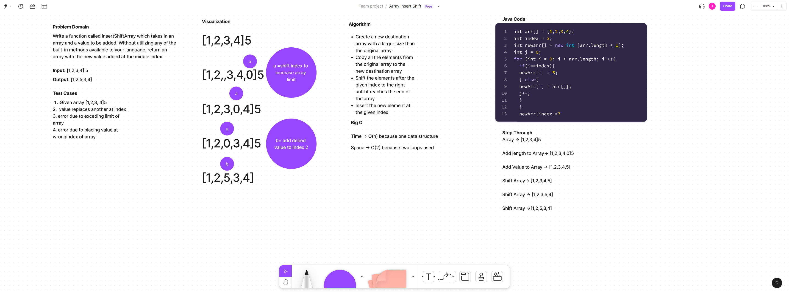

# Array Insert Shift

Write a function called insertShiftArray which takes in an array and a value to be added. Without utilizing any of the built-in methods available to your language, return an array with the new value added at the middle index.

## Whiteboard Process

## Approach & Efficiency
I attempted to create a new array with a larger size than the original array. I then copied all the elements from the original array to the new destination array. Then I
shifted the elements after the given index to the right until it reaches the end of the array. Finally, I insert the new element at the given index. I feel like this is a lot harder to find a way to do this without imports and using java methods to add and shift the array. I used a lot of sources and tried to combine them in a way that it'll work.

Big O:

Time -> O(n) because one data structure

Space -> O(2) because two loops used

## References

https://www.youtube.com/watch?v=qLSFHyTs0io
https://www.youtube.com/watch?v=77N5qsea8qQ
https://docs.oracle.com/javase/tutorial/java/nutsandbolts/arrays.html
https://www.javatpoint.com/add-elements-to-array-in-java
