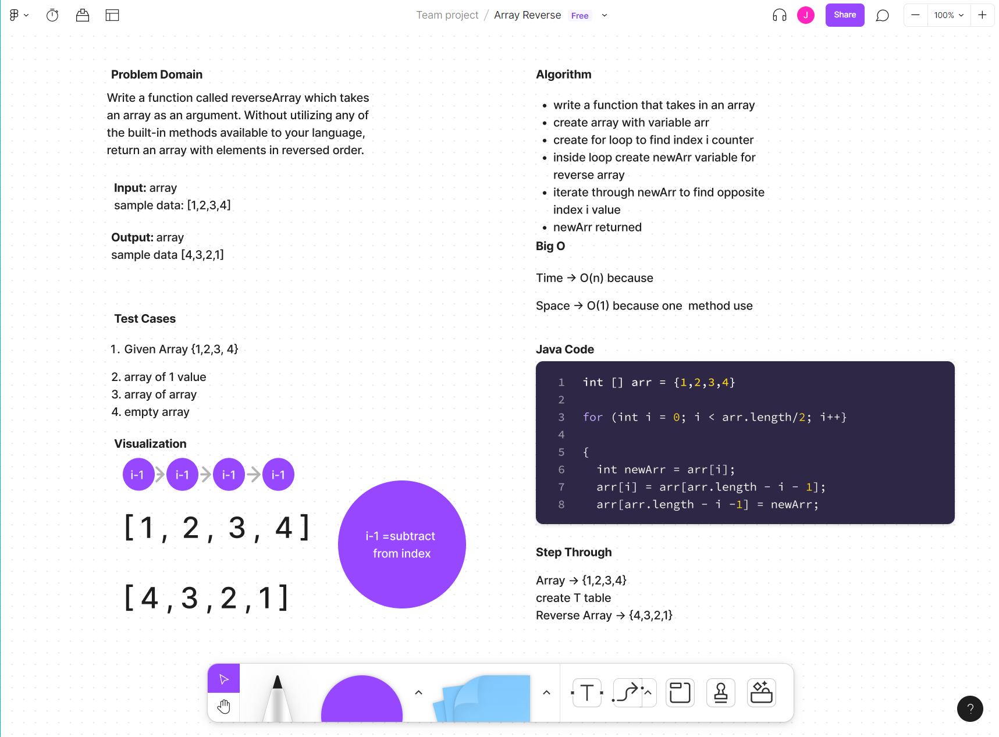

# Array Reverse

Write a function called reverseArray which takes an array as an argument. Without utilizing any of the built-in methods available to your language, return an array with elements in reversed order.

## Whiteboard Process

## Approach & Efficiency

I used a for loop to find the index of i in an array and made a counter to subtract by 1 to create a new, reverse array

Big O:

Time is O(n) because one data structure

Space is O(1) because one method used

## References

https://www.youtube.com/watch?v=77N5qsea8qQ
